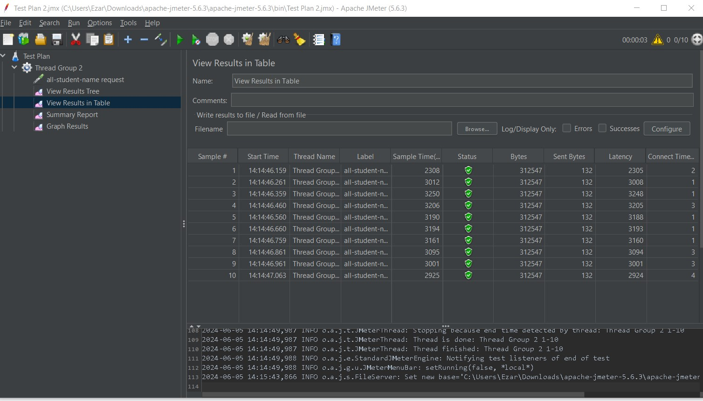
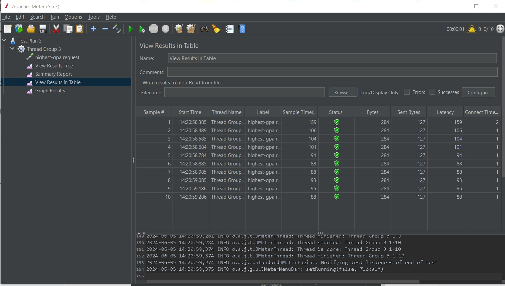
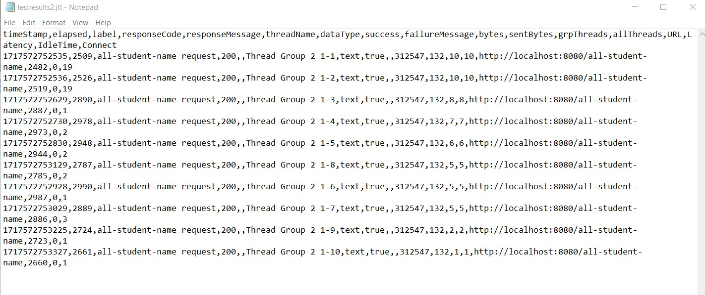
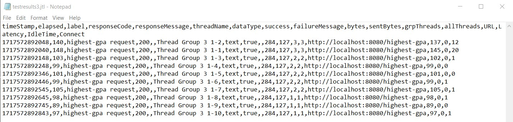
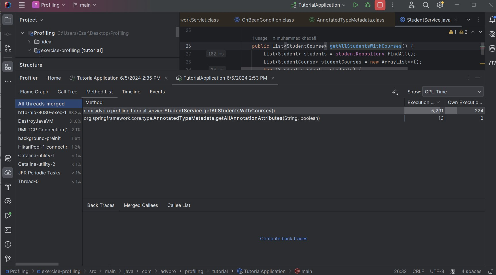
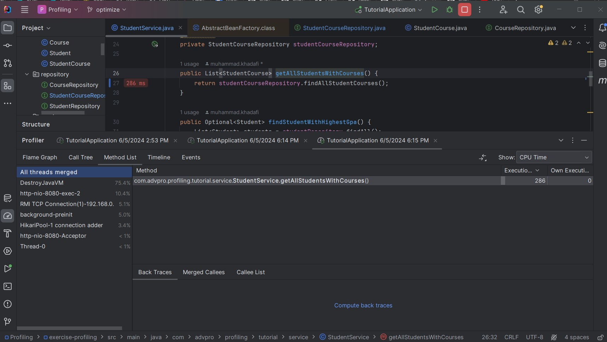
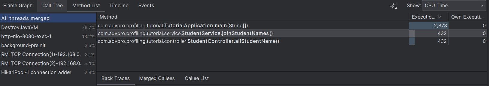
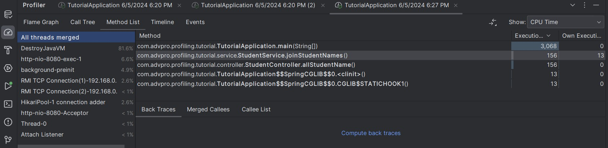

Mochammad Ezar Yudha 2206046746

<h1>Module 5</h1>
<h2>JMeter Test Plans</h2>
<h3>View Results in Table (/all-student-name)</h3>

<h3>View Results in Table (/highest-gpa)</h3>

<h3>Results using command line (/all-student-name)</h3>

<h3>Results using command line (/highest-gpa)</h3>

<h2>Optimization</h2>

<h3>CPU time before optimization (/all-student)</h3>

<h3>CPU time after optimization (>20% performance improvement) (/allstudent)</h3>

<h3>CPU time before optimization (/all-student-name)</h3>

<h3>CPU time after optimization (>20% performance improvement) (/all-student-name)</h3>

